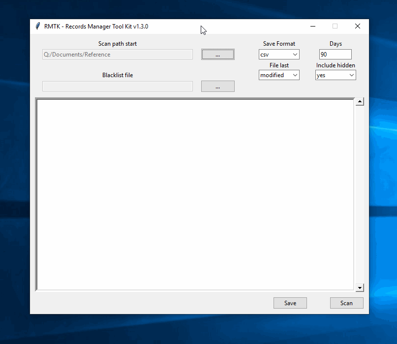

# RMTK - Records Manager Toolkit

## Description

This project, completed in 2015/2016 was an attempt to create a GUI front-end and
reusable CLI library to aide in scanning drives for files older than a prescribed
date (adjustable).



## Features

* Export scan results to a text file or CSV file
* records.py module is decoupled from tkinter GUI so could be used elsewhere
* Only requires tkinter library, which comes with Python
* Updated to require Python 3.x+
* Ability to load 'blacklist' file (newline-separated patterns), which
engine will skip when looking for matches
* Ability to change cutoff date (default is 90 days from time you run
the scan)
* Ability to ignore any hidden file/folders while scanning
* Scan using either 'Last Modified' or 'Last Accessed' fields as the
arbitrer of cut off calculations.

## Installation (Windows-only)

### Preparation

1. Be running Python 3.x+ (tested recently on 3.8.2)
1. Usual git clone of this repo, e.g., ```git clone https://github.com/crajun/records-manager.git C:\temp\```
1. Create virtual environment to install necessary packages to build the
application:

```cmd.exe
cd C:\temp\records-manager
python -m venv .env
cd .env/Scripts
activate.bat
cd ..\..
pip install -r requirements.txt
```

### Building the executable

1. Run the installer script: ```python setup.py build```
1. Run the executable found in the build/exe... folder

## Limitations

* Could be extremely slow giving results (python limitation)
* ditto, but because at the time I did not use asynchronous methods
and wrote UI blocking code (partly because I didn't know how at the
time, and partly because at the time async was new in Python 3 and
I was trying for 2/3 support).
* Quite a few obvious bugs...no test framework to speak of...
